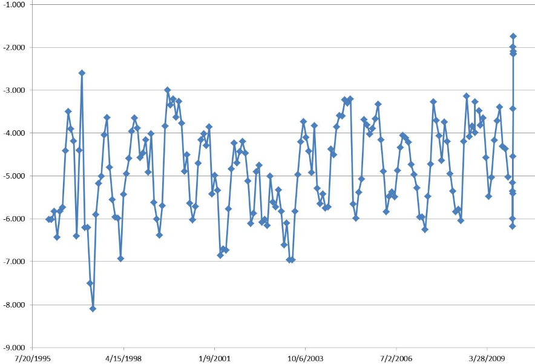
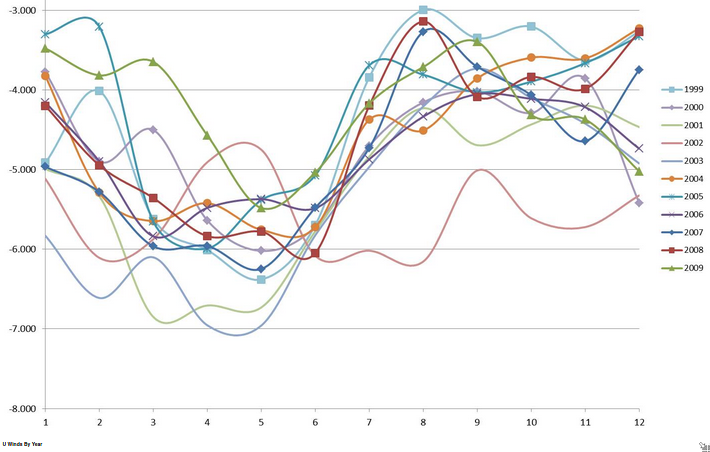
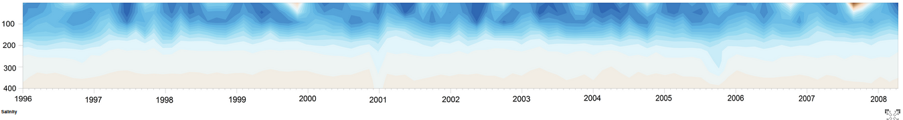

Seasonal Impacts

Over the past years, the zonal wind has shown marked seasonality, with values ranging from 4 m/s, between August and January, to 10 m/s between February and June (Figure 1a). Wind speed has a seasonal cycle that is generally coincident with that of temperature (Figure 3); winds are strongest during the first few months of the year. A cross-correlation analysis between satellite-derived SST and scalar wind intensity (Figure 2) shows maximum correlation at a positive lag of 1-2 weeks, demonstrating that changes in the wind preceded changes in SST by a few days (Astor et al., 2003). However, a decreasing trend in wind strength has been noted since 1995, driven by a shift in the position of the ITCZ (Taylor et al., 2012). Indeed, weaker winds have been measured since 2004 (Figure 1b), and this has impacted both the intensity of primary and secondary production in the Cariaco Basin. The weaker winds and weaker upwelling, coupled with overfishing in the region, led to the collapse of the sardine fishery in 2005 (Taylor et al., 2012). This fishery, the most important of the Southeastern Caribbean Sea, has not recovered since. Shifts in community composition have also been observed in the phytoplankton (e.g. Mutshinda et al., 2013; Pinkney et al., 2014), as well as changes in the abundance of zooplankton, suggesting an entire ecosystem shift since 2005.

Peak sea surface temperatures of ~29.0°C are reached in September, and a minimum of about 23.0°C occur in March (Figure 3). Low sea surface temperatures during the first months of the year are related to the surfacing of the cold, nutrient rich Subtropical Underwater (SUW) near and inside the Cariaco Basin. Nutrient distributions in oxic waters of the Cariaco Basin vary seasonally with fluctuations in rates of upwelling and primary productivity (Scranton et al., 2006). Within the SUW, nitrate concentration is 5-10 mM, and as this water is brought to the surface it provides nutrients that stimulate phytoplankton growth (Walsh et al., 1999). Variations in the intensity of ventilations, intrusion of oxygenate water at depths greater than 150 m ( Scranton et al., 2001; Astor et al., 2003), also affect the distribution of nutrients in the suboxic zone. Intrusions of oxygenated water into deep, sulfidic layers occur intermittently, influencing distributions of nitrite and phosphate (Scranton et al., 2006; 2014).

The upwellings seen during the winter-spring of 1996, 1997 and 2001 are considered strong events in which the surface temperatures were lowered to 21.5°C, and the average primary production during upwelling exceeded 2 gC/m²/d. The upwelling event during 1998 was a shorter and weaker event (1.3 gC/m²/d), which is thought to have been caused by teleconnection to the strong El Niño-Southern Oscillation in the first part of that year. The upwelling events during 1999, and 2000, are considered normal periods in which the surface temperatures are lowered to 23°C and the average primary production was 1.7-1.8 gC/m²/d. The upwelling seasons of 2002 and 2003 showed a return to normal/strong conditions (average production > 2 gC/m²/d; Figure 3), yet since 2004 weak upwelling strengths have prevailed, with average integrated primary production of 1.5 gC/m²/d during the upwelling season. The weakening of the upwelling and lowered primary production rates have affected the regional sardine fisheries. Fisheries decline has economically impacted the region severely, and several fisheries have closed. Eastern Venezuela sardine harvests constitute the most important fishing industry in the country and the Caribbean Sea. In general, annual production is estimated to be between 540-600 gC/m²/y, depending on the strength of short-lived upwelling events, except in 1998 when a rate of <300 gC/m²/y was estimated ([Figure 4](figure-4.pdf)). Average annual production for 2004-2014 was of ~340 gC/m²/y. A summer upwelling, or a secondary upwelling, has been identified occurring almost every year in the months of June-July. Its occurrence has been linked to the seasonal increases in the cyclonic curl of the wind in the southern Caribbean and a concurrent increased frequency of anticyclonic eddies in the Venezuelan basin, which could cause dynamic uplifting of isotherms in the south along the continental shelf (Rueda, 2012)

Features noted in the temperature data are evident in the other hydrographic parameters such as salinity (Figure 5). Surface salinities between August and October are fresher (<36.5), coincident with the rainy season. Salinity in the Cariaco Basin is also affected by local phenomena, such as hurricanes. In late 2007, the region experienced a large rainfall event caused by hurricane Felix, which passed close to the Venezuelan coast. The heavy rains effectively decreased the sea surface salinity at the CARIACO time-series station to the lowest recorded during 2007 (35.8) or during previous years (Figure 5). This decrease in salinity affected also the TCO², lowering it to ~1990 M/Kg (average surface TCO² ~ 2070 M/Kg).

Both Chlorophyll-a concentrations and depth-integrated (0-100 m) primary production change substantially with season. Production also changes in response to strong hydrographic events such as the ones of 1996-1997 and 1997-1998 (Figure 4).

The vertical flux of organic carbon measured with the sediment traps follows a regular pattern, with somewhat lower values during the rainy season (June-November) and higher values during the upwelling season (December-April) (Figure 4). The magnitude of the flux tends to decrease with increasing water depth, and similar temporal variability is observed at all 4 depths. The material reaching the bottom of Cariaco is rich in opal, carbonate, organic nitrogen, and organic carbon; lithogenic material accounts for ~50% of the total annual particulate flux (Thunell et al., 2000). The largest organic carbon flux recorded since 1995 was seen in the 1,200 m trap sample in early July 1997, and was associated with a turbidite generated by an earthquake that occurred along the Venezuelan coast. This event was described by Thunell et al. (1999). Other regional events, such as the floods of 1999 (Lyon, 2003) and the heavy rains of 2004, also affect delivery of material to the sediment traps (Lorenzoni et al., 2009)

Drifting sediment traps at depths of 50 and 100 m (within the euphotic zone) were deployed between 2007-2008, with the aim of understanding the connection between particle generation and flux in the euphotic zone (Montes et al., 2012). This is an important complement to the moored sediment traps, which are located below the euphotic zone to minimize fouling.
