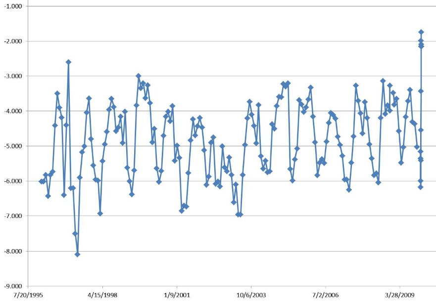

# The Cariaco Basin

The ocean time series study area is the Cariaco Basin; a large (∼160 km long, 70 km wide) and deep (∼1,400 m)basin, located on the Venezuelan continental shelf (Figure 1 and 2), occupying an area of approximately 11.200 km2. It is bound to the north by a sill connecting Margarita Island to Cabo Codera, at a mean depth of about 100 m with two channels breaching this sill (La Tortuga: ∼135 m and Centinela: ∼146 m). The basin is divided into two sub-basins, one eastern and one western, separated by a saddle of approximately 900m deep (Schubert, 1982).

The upper waters of the basin are in constant exchange with Caribbean waters through the channels, but the sill depth restricts any water exchange below 140m. The Cariaco Basin experiences marked seasonal upwelling (Richards, 1975; Muller-Karger et al., 2001), induced by the Trade winds, which blow more intensely during the first half of the year (February-May), with sustained measured speeds of (>6 m s-1) and an E NE direction. Between August-November, winds are weaker (<6 m s-1) and the direction varies, often associated with meteorological perturbations (depressions, hurricanes) that cross the Caribbean. During the last decade, 1996, 1997, 2001 and 2003 have been years of strong wind, while between the years 1997-2000 winds remained low. Since 2004 wind strength has remained below average historical values, which have affected the primary production of the area significantly. Variations in wind strength are tightly coupled with the hydrography of the region, and control the intensity of the upwelling. Because of the upwelling, which brings essential nutrients to surface waters, primary production rates are high. Figure shows satellite images of a typical upwelling in the Cariaco Basin (see caption for details). Much of the organic material produced in the upper water column remains ungrazed and sinks, generating a flux of particles between the surface and the deep basin. Sill restricts water motion and the lateral flux of material below about 140 m depth, making Cariaco a natural sediment trap within a continental shelf. Because the turnover of basin waters is slow, the decomposition of the sinking material leads to permanent anoxia below about 250m. Around this depth, at the oxic-anoxic interface, a unique environment exists. The interface harbors a rich microbial community mostly composed of chemoautrotrophs, which generate and transform organic material, and likely alter the flux and composition of particles that travel through the water column (Scranton et al., 2006).

Because of these permanent anoxic conditions (no bioturbation), sediments accumulate at the bottom of the basin in varves (laminated sediments, Figure), providing a detailed record of annual to decadal scale change over several dozen millennia (Peterson et al., 2000; Haug et al., 2001). The lamina alternate between light and dark, corresponding respectively to the highly productive upwelling period and terrigenous material coming from the coast. The scientific community in general has recognized the importance of this highly detailed sedimentary record in the Cariaco Basin. However, in order to understand it and accurately interpret it, it is necessary to understand the seasonal changes that occur in the region, as well as the biogeochemistry of the water column.
