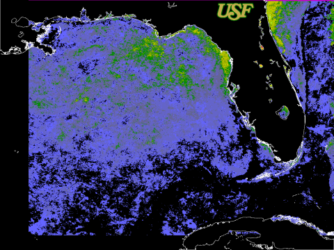

This site contains satellite image products designed to evaluate extreme environmental conditions that are potentially harmful to coral reef ecosystems.
These products are a result of a NASA-funded project entitled: "A Decision Support System for Ecosystem-Based Management of Tropical Coral Reef Environments" (NASA Grant NNX09AV24G), conducted in collaboration with the NOAA Coral Reef Watch (CRW) program and NASA's Ames Research Center.

The indices published in these pages are based on the methods used by the [NOAA Coral Reef Watch (CRW) program](http://www.coralreefwatch.noaa.gov/satellite).
These products are experimental.
For an in-depth explanation of these products and their application over global scales, please refer to [NOAA's CRW methods website](https://coralreefwatch.noaa.gov/satellite/methodology/methodology.php).
In this case, products are derived from an average night-time only SST from several AVHRR sensors (including NOAA 16, 18, and 19).

Imagery from the NOAA Advanced Very High Resolution Radiometer (AVHRR) and NASA Moderate Resolution Imaging Spectroradiometer (MODIS) are used to compute two different products: HotSpots and Degree-Heating-Weeks (DHW).
These products are available for dates 1994-01-03 through 2016-08-08 using the [legacy product search tool](http://imars.marine.usf.edu/images/avhrr/florida/calendar/year/1994?field_product_type_tid=82).  
The color legends for these products are included in these pages. The archive is arranged by year and month.
If there is a link present, data is available for that particular timeframe. When choosing a product date, you will be presented with thumbnail imagery to get a quick glance at the data.

HotSpots are defined as the difference between the measured (1 km) near-real-time nighttime only sea surface temperatures (SST) and the AVHRR Pathfinder (version 5.0) maximum monthly mean (MMM) SST derived from a 4km climatology.
Only positive values are derived, since the HotSpot is designed to show the occurrence and distribution of thermal stress conducive to coral bleaching.

DHW values measure cumulative heat stress from SST anomalies above the maximum monthly mean summed over the previous 12 weeks.
The DHWs products are updated twice-weekly following the approach defined by NOAA CRW.

We next plan to integrate MODIS satellite data into the CRW assessments, and are developing a SST climatology consistent with that used by NOAA to compute the CRW products.

## Project Partners

* [NOAA Coral Reef Watch](http://www.coralreefwatch.noaa.gov/satellite/)
* [NASA - Ames](http://geo.arc.nasa.gov/)
* [UNEP World Conservation Monitoring Centre](http://www.unep-wcmc.org/)
* [Cooperative Institute for Research in Environmental Sciences](http://cires.colorado.edu/)
* Institute of Marine Remote Sensing - University of South Florida
