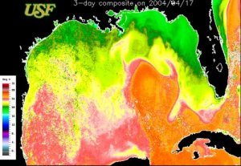

The National Oceanic and Atmospheric Administration (NOAA) operates the series of Polar-orbiting Operational Environmental Satellites (POES). Currently, AVHRR data is obtained from four POES satellites; 12, 15, 17 and 18. The AVHRR sensor uses IR data to provide information about the sea-surface temperature (SST). With four satellites, AVHRR has a temporal resolution of acquiring up to 16 images a day (2 day and 2 night images per satellite per day) at a spatial resolution of about 1 km. Not only are these data used by marine researchers to study the ocean but also provide meteorologists key information as to the direction and strength of hurricanes still over the water.
