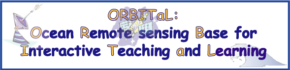

Here at ORBITaL you will learn all about how scientists use satellites to study the ocean. From coral reefs to red tides, we can see it all!

Come with us as we tour the internet's vast resources and gather information about this incredible technology.

First, you will want to take the Remote Sensing tour with our tour guide, Rita. She will take you through the information online and help you to understand what remote sensing is and how these satellites work.

Then, you can go to the WebCourses and choose a topic of interest. One of our scientists will guide you through the information available online and through questions and InterActivities you will learn how we "see" the ocean from space!

Sounds like fun, right? Go ahead and get started and if you have any questions or comments please contact us!
