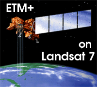

There are a series of satellites called Landsat that gather optical data. The first Landsat, launched in 1972, was primarily used to study agriculture and to determine the size and yield of a farm or field. Landsat 7 was launched in 1999 by NASA and is the current satellite in orbit, and is often used for marine or coastal studies. Landsat 7 follows a polar orbit with a temporal resolution of 16 days. Landsat 7 carries a sensor called the Enhanced Thematic Mapper Plus (ETM+), which has a spatial resolution of 30 meters (m), roughly the size of the infield diamond of a baseball field is (30m X 30m). The ETM+ sensor has a spectral resolution of eight bands in the VIS and IR range, used mainly to map and monitor land and the coastal zone (shallow-water).
