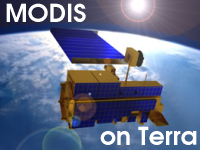

There are two MODIS sensors in operation by NASA onboard the satellites Terra and Aqua. These satellites are in a tandem orbit so that the first gathers data in the morning and the second in the afternoon, which means that imagery is gathered at least twice a day. MODIS is just one of five sensors onboard each of the satellites. MODIS alone takes measurements of the ocean, atmosphere and land in the VIS and IR spectral ranges. Marine applications include SST and ocean color data acquisition at a spatial resolution of 1 km.
