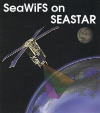
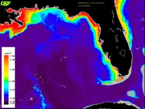

 The SeaWiFS sensor is flown onboard the SeaStar satellite and was launched in 1997 by NASA for Orbital Sciences (now GeoEYE). SeaWiFS is an ocean color sensor, which is used as to measure chlorophyll concentration and as a proxy for primary productivity. SeaWiFS has a daily temporal resolution (passes over every day) and a 1 kilometer (km) pixel size. To provide scientists information on ocean color, SeaWiFS provides data in the UV, VIS and IR spectral ranges for the open ocean environment.
