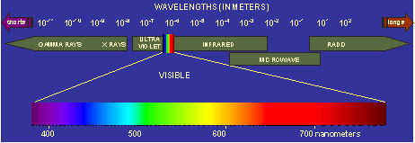

What is Remote Sensing?

[Lilles and Kiefer](http://education.imars.usf.edu/index.php?option=com_content&task=view&id=63&Itemid=112#landk) define remote sensing as the “science and art of obtaining information about an area through data acquired by a device that is not in contact with the area under investigation.". That is a mouthful. we can say simply that remote sensing is the study of one location from another. There are different types of sensors used in remote sensing. These are acoustic (sonar), optic, and radar sensors. These sensors can be carried onboard a ship, airplane or satellite.

[Click here to tour the information on acoustic remote sensing](http://www.etl.noaa.gov/ams_measurement/2003SC_SMOI_2.pdf)

[Click here to tour the information on radar remote sensing](http://www.itc.nl/%7Ebakker/sar.html)

We are going to look at optical satellite remote sensing data. An optical satellite sensor measures how much light is coming from the Earth’s surface. The light can be reflected or radiated. Light is made up of energy. The energy is found at different wavelengths in the electromagnetic spectrum. In Optical remote sensing we look at light from three different areas of the spectrum.
These are the [ultraviolet (UV)](http://imars.marine.usf.edu/orbital/node/1572427#uv), visible (VIS) or infrared (IR) areas.

It is the scientist's job to figure out what the information from the satellite means. This is just like the way you use your eyes (the sensor) to see things around you (detect light) and send that information to your brain (instrument) to interpret what you are seeing.

[Click here to tour the National Aeronautic and Space Administration (NASA) optical remote sensing tutorial](http://rst.gsfc.nasa.gov/)

*Remote sensing Quiz Question:*

What is remote sensing and how does it work?

~~Now, we will review what you have just learned about remote sensing and how it works, specifically ocean color remote sensing, by playing the game below. Have fun!!~~

This game has been removed due to use of unsafe and outdated technology.

**Note**: This game used Adobe Flash player - a technology that is no longer supported. For more info go to http://www.adobe.com/go/getflashplayer.
