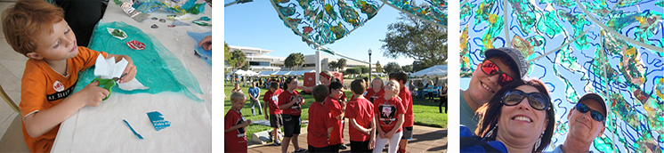

## Preventing Marine Debris by Reducing Inland Littering

The National Marine Debris Tracking Program identified the top five forms of marine debris as: plastic straws, plastic bottles, plastic bags, metal beverage cans, and balloons.

clean comm img 1Inland littering and insufficient waste management practices are primary causes of marine debris in coastal communities. To increase effective litter prevention and reduction outcomes, the Clean Community-Clean Coast education and outreach campaign created awareness of marine debris impacts through information, hands-on activities and messages that resonated with specific audiences and address context-specific social norms.

The **Clean Community Clean Coast** project was funded by a grant from the NOAA Marine Debris Prevention program in the Office of Restoration. The Clean Community was led by Frank Muller-Karger and CJ Reynolds at the USF CMS, working in partnership with the USF College of Behavior and Community Sciences (CBCS), USF St. Petersburg College of Education (COE), Keep Pinellas Beautiful (KPB), Tampa Bay Watch (TBW), Georgia State University (GSU) School of Art and Design. Other partners included: the St. Petersburg Science Festival, City of St. Petersburg Public Works and Parks and Recreation Departments, The Florida Aquarium, The Georgia Aquarium and several youth programs and art museum.

Working together, the partners created a series of new education and research programs and public engagement activities in Pinellas County, Florida and Atlanta, Georgia from 2014-2016 that educated and inspired thousands of youth, educators and personell working in municipalities and civic organizations.  

* **Youth Programs**: The team of researchers, community organizations and environmental educators conducted multiple faciliated group discussions, pre-post assessments and workshops with middle and high school students.  Keep Pinellas Beautiful and USF CMS piloted a new KBP Youth Environmental Leadership workshop which provided an overview of watersheds, storm drain systems, runoff and inland trash and activities to develop understanding of communications and social media. The goal of the workshop to increase youth knowledge and support their ideas for environmental awareness programs at their school and increase peer-to-peer outreach. Other summer programs were conducted with Girls Inc Pinellas and the East Atlanta Kids Club. Tampa Bay Watch developed new presentations which addressed littering behavior, storm drains and microplastics in their Experiential Edventures programs which was seen by more than 900 students from Pinellas and Hillsborough Counties.
* **Municipal Programs**: In 2016, the USF CMS and KPB team hosted the Collaborating for Clean Communities Forum which engaged 50 municipal staff, elected officials and local businesses in a day long workshop to discuss root causes of littering in specific public spaces, such as waterfronts,parks, neighborhood  and beaches and increase perspectives of values, attitudes, and onsite signage to support positive behavior change. This forurm featured engaging sessions from behavioral experts and authors of Litterlology and round table discussions about common issues chosen by the participants. The one-day forum sparked increased collaboration between organizations and several municipalities implemented additional green and sustainablities programs. The Forum was strongly supported by outreach professionals at UF Pinellas County Extension. The speakers were sponsorsed by Visit St. Pete/Clearwater and the space and food were inkind contributions from the City of Gulfport, Chick Fil-A and others.
* **Public Art and Community Engagement**: The 4Cs team of artists included faculty and students from Georgia State University and emerging artists from Atlanta, GA. The team engaged hundreds of youth and the families St. Petersburg, FL and Atlanta, GA, in hands-on art making activities to support the creation of Current Collections, a massive steel and plastic sculpture made with reclaimed plastics and marine debris. The Museum of Fine Art and the Dali Museum in St. Petersburg and the other leaders in the arts community in St. Petersburg offered their facilities and supported outreach for the workshops. The sculpture was exhibited in St. Petersburg and Centennial Park, Atlanta. It was also selected for the prestigious Art Prize annual event and was exhibited in Ann Arbor, Mighican. In December 2016, the City of St. Petersburg public arts commission purchased the scultpure and it's permanently located in Poynter Park, near the USF campus.   
* **Science Festivals**: The 4Cs partners developed new materials and activities for the 2014 and 2015 St. Petersburg Science Festivals, which attracted more than 15,000 people each year.  The activities leveraged the Current Collections sculpture, which was located in the festival space. The USF College of Education and College of Marine Science,  Tampa Bay Watch, Keep Pinellas Beautiful and the City of St. Pete storm water department each created new educational activities for the middle school classes that attended on Friday, before the public day of the Science Festival.

## Turning Trash into Visual Treasure
To create awareness and spark dialogue about the connection between litter and marine debris, artists created a massive sculpture, which represents an ocean vortex. Inside the sculpture, viewers experience swirling currents created from reclaimed plastic collected by volunteers from community and coastal cleanups. Children in St. Petersburg and Atlanta helped make the colorful panels embedded in the plastic membrane.
The [Current Collections sculpture](http://www.seatheunseen.com/), created by Embodied Energy Studio LLC, is in Poynter Park across from the Poynter Institute at 801 3rd Street South in St. Petersburg, FL.

***Installing the Sculpture.*** *Tom Cawthon of the Poynter Institute generously filmed [this video](https://www.youtube.com/watch?v=lECoVx0mNlU) which shows the key steps in the five-day onsite construction process of the Current Collections sculpture.*

**Funded by a 2014 NOAA Marine Debris Prevention, Education and Outreach Program Cooperative Agreement Grant**

